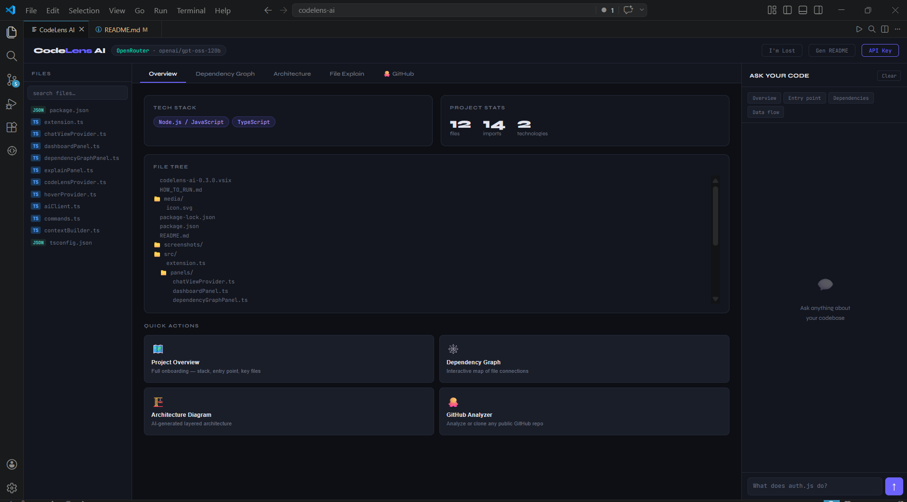
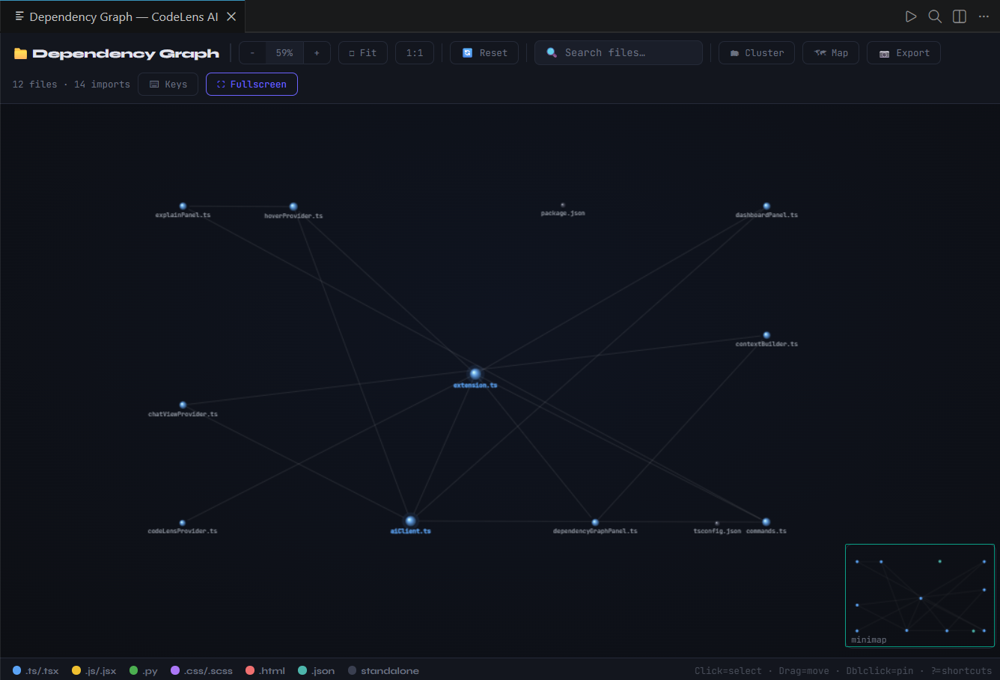
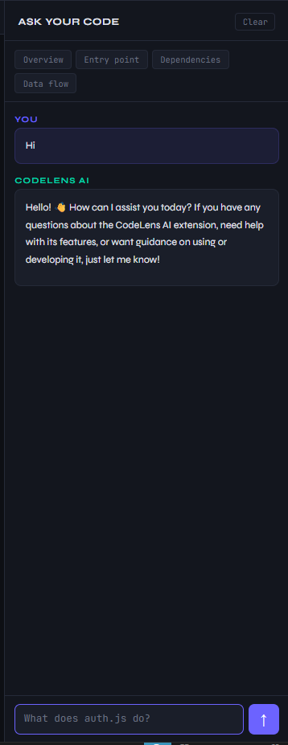
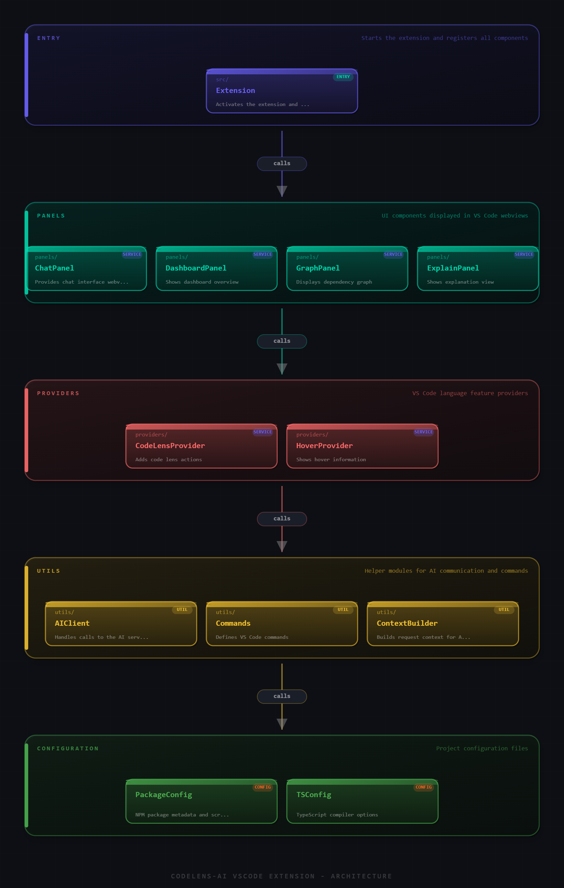
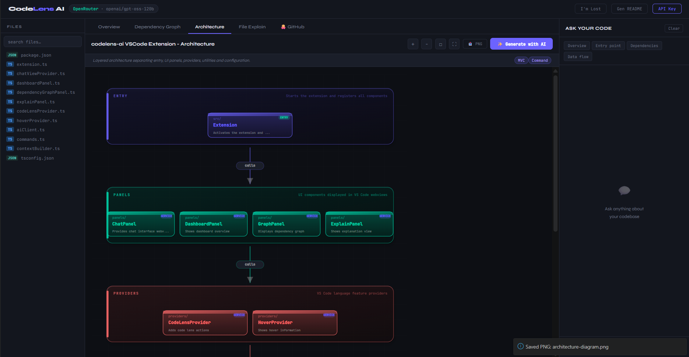

<div align="center">


# CodeLens AI

### AI-powered codebase understanding for VS Code

**Explain files · Visualize dependencies · Generate architecture diagrams · Chat with your code**

[](https://marketplace.visualstudio.com/items?itemName=your-publisher.codelens-ai)
[](https://marketplace.visualstudio.com/items?itemName=your-publisher.codelens-ai)
[](LICENSE)
[](https://www.typescriptlang.org/)

</div>

---

## What is CodeLens AI?

CodeLens AI is a VS Code extension that helps you **understand any codebase instantly** — whether it's a project you just cloned, an inherited legacy codebase, or your own code you haven't touched in months.

Instead of spending hours reading through files, CodeLens AI gives you:
- An **interactive dependency graph** showing how files connect
- **AI explanations** for any file or selected code block  
- An **AI-generated architecture diagram** showing your project's layers
- A **chat interface** to ask anything about your codebase
- A **GitHub analyzer** to understand any public repository

> Users bring their own API keys — CodeLens AI works with Anthropic, OpenAI, Gemini, Groq, Ollama (local/free), and OpenRouter.

---

## Features

### 🗂 Dashboard — Command Centre
One panel with five tabs: Overview, Dependency Graph, Architecture, File Explain, and GitHub Analyzer. Open it with `Ctrl+Shift+A` or click the CodeLens AI icon in the Activity Bar.

### 🕸 Dependency Graph
An interactive force-directed graph of all file imports in your project.

- **3D sphere nodes** colored by file type (`.ts` = blue, `.py` = green, `.css` = purple, etc.)
- **Click a node** to highlight all its imports and dependents
- **Drag nodes** to rearrange; **double-click** to pin/unpin
- **Zoom** with scroll wheel or `+`/`-` keys; **Fit** with `0`
- **Fullscreen mode** — opens a dedicated panel with minimap, export PNG, cluster by folder, and node info panel
- **Search** to filter and auto-jump to matching files

### 🏗 Architecture Diagram
Click **Generate with AI** and CodeLens AI builds a layered SVG diagram of your project's architecture — automatically choosing 2–6 layers based on your actual file structure. Supports zoom, pan, and fullscreen overlay.

### 📄 File Explain
Click any file in the sidebar to get a structured AI explanation:
- One-sentence summary
- What the file does (bullet points)
- Dependencies and imports
- What uses this file
- Gotchas and notes

### 💬 AI Chat
Ask natural language questions about your codebase. The AI has full context of your file tree and tech stack.

> *"What's the entry point?"*  
> *"How does authentication work?"*  
> *"Where is the database connection configured?"*

### 🐙 GitHub Analyzer
Paste any public GitHub URL for a full AI analysis — tech stack, architecture, key files, code quality verdict, and stats (stars, forks, languages). Includes a **Clone & Open** button to clone directly into VS Code.

### 🔍 Hover Explanations
Hover any symbol in the editor for a 1–2 sentence AI explanation. Click **Explain in detail** to open a full side panel with streaming analysis.

### 📝 Generate README
One click generates a professional `README.md` from your project's file tree, tech stack, and structure.

---
## 📸 Screenshots

### 🧭 Dashboard



---

### 🔗 Dependency Graph



---

### 📄 File Explanation


---

### 💬 AI Chat



---

### 🏗 Architecture Diagram




---

## Supported AI Providers

| Provider | Models | API Key Required |
|----------|--------|-----------------|
| **Anthropic Claude** | claude-opus-4-5, claude-sonnet-4-5, claude-haiku | Yes |
| **OpenAI** | gpt-4o, gpt-4-turbo, gpt-3.5-turbo | Yes |
| **Google Gemini** | gemini-2.0-flash, gemini-1.5-pro | Yes |
| **Groq** | llama3, mixtral (ultra-fast) | Yes |
| **Ollama** | Any local model | **No — runs free locally** |
| **OpenRouter** | 50+ models via one key | Yes |

Switch providers anytime from the dashboard or via `CodeLens AI: Switch Provider`.

---

## Installation

### From VS Code Marketplace *(recommended)*
1. Open VS Code
2. Press `Ctrl+Shift+X` to open Extensions
3. Search for **CodeLens AI**
4. Click **Install**

### From VSIX *(manual)*
```bash
code --install-extension codelens-ai-1.0.0.vsix
```

### Requirements
- VS Code **1.85+**
- Node.js **18+** (for building from source)
- An API key from any supported provider, **or** [Ollama](https://ollama.com) running locally

---

## Quick Start

1. **Open a project folder** — `File → Open Folder`
2. **Click the CodeLens AI icon** in the Activity Bar (left sidebar)
3. The dashboard opens automatically
4. **Set your API key** — click `API Key` in the top-right of the dashboard
5. **Explore your codebase** — try the Dependency Graph tab or click a file in the sidebar

### Keyboard Shortcuts

| Shortcut | Action |
|----------|--------|
| `Ctrl+Shift+A` | Open Dashboard |
| `Ctrl+Shift+E` | Explain selected code |

---

## Configuration

Add to your VS Code `settings.json`:

```json
{
  "codelensai.provider": "anthropic",
  "codelensai.model": "claude-opus-4-5",
  "codelensai.ollamaUrl": "http://localhost:11434"
}
```

| Setting | Default | Description |
|---------|---------|-------------|
| `codelensai.provider` | `anthropic` | AI provider (`anthropic`, `openai`, `gemini`, `groq`, `ollama`, `openrouter`) |
| `codelensai.model` | *(provider default)* | Model override — leave empty to use provider default |
| `codelensai.ollamaUrl` | `http://localhost:11434` | Ollama server URL |
| `codelensai.enableCodeLens` | `true` | Show Explain hints above functions in the editor |
| `codelensai.maxFileSize` | `50000` | Max file size (bytes) sent to AI |

> **API keys are stored securely** in VS Code's built-in secret storage — never in plain text files.

---

## Commands

Access via `Ctrl+Shift+P` (Command Palette):

| Command | Description |
|---------|-------------|
| `CodeLens AI: Open Dashboard` | Open the main dashboard panel |
| `CodeLens AI: Explain This File` | AI explanation of the current file |
| `CodeLens AI: Explain Selected Code` | AI explanation of the selected code block |
| `CodeLens AI: Project Overview` | Full onboarding — entry points, stack, architecture |
| `CodeLens AI: Show Dependency Graph` | Open the standalone dependency graph panel |
| `CodeLens AI: Generate README` | Auto-generate a README.md for your project |
| `CodeLens AI: Switch AI Provider` | Change AI provider |
| `CodeLens AI: Set API Key` | Set or update your API key |
| `CodeLens AI: Show Current Provider` | View active provider and model |

---

## How It Works

### Dependency Graph — Physics Simulation
The graph uses a **force-directed layout** with:
- **Fibonacci spiral initialization** — nodes are spread evenly across the canvas before the first simulation tick (prevents the explosion-to-edges bug where all nodes start at 0,0)
- **Capped repulsion forces** — `min(k²/d, k×3)` prevents infinite forces at near-zero distances
- **Hard boundary clamp** — nodes cannot leave the canvas
- **3D sphere shading** — radial gradient per node with specular highlight and drop-shadow ellipse

### Architecture Diagram
The AI is prompted to return raw JSON describing 2–6 layers chosen based on your actual file structure. Two parse strategies handle models that wrap JSON in markdown fences. The SVG is rendered inline with zoom, pan, and a fullscreen overlay.

### Context Building
The extension scans your workspace (ignoring `node_modules`, virtual envs, lock files, and build artifacts) and extracts:
- **Import/require statements** to build the dependency edge list
- **File extensions and `package.json`/`requirements.txt`** to detect the tech stack
- **Directory structure** for the file tree sent to the AI

---

## Project Structure

```
codelens-ai/
├── src/
│   ├── extension.ts              # Entry point, command registration
│   ├── panels/
│   │   ├── dashboardPanel.ts     # Main webview (all 5 tabs)
│   │   ├── explainPanel.ts       # Side panel for code explanations
│   │   └── dependencyGraphPanel.ts  # Standalone fullscreen graph panel
│   ├── providers/
│   │   ├── codeLensProvider.ts   # "Explain" hints above functions
│   │   └── hoverProvider.ts      # Hover tooltip explanations
│   └── utils/
│       ├── aiClient.ts           # Multi-provider AI client with streaming
│       ├── commands.ts           # Command implementations
│       └── contextBuilder.ts     # File scanning, dependency map, tech stack detection
├── media/
│   └── icon.png                  # Extension icon (128×128)
├── package.json                  # Extension manifest
├── tsconfig.json
└── README.md
```

---

## Building from Source

```bash
# Clone the repository
git clone https://github.com/your-username/codelens-ai.git
cd codelens-ai

# Install dependencies
npm install

# Compile TypeScript
npm run compile

# Press F5 in VS Code to launch Extension Development Host
```

### Package and publish

```bash
# Install vsce
npm install -g @vscode/vsce

# Package (creates .vsix)
vsce package

# Publish to Marketplace
vsce publish
```

---

## Troubleshooting

| Problem | Fix |
|---------|-----|
| Dashboard shows "Loading…" forever | Make sure a folder is open (`File → Open Folder`). Check that your API key is set. |
| Dependency graph shows only 2–3 nodes | Your files may not use ES import/require syntax. The graph only detects static imports. |
| Architecture diagram blank after Generate | The AI failed to return valid JSON. Click Generate again — Claude and GPT-4o work best. |
| Hover provider not working | Reload VS Code window (`Ctrl+Shift+P → Developer: Reload Window`). |
| Ollama not connecting | Ensure Ollama is running: `ollama serve` |
| Clone fails | Ensure `git` is installed and available in your PATH. |
| GitHub rate limit hit | The GitHub API allows 60 unauthenticated requests/hour. Wait a minute and try again. |

---

## Privacy

- **Your code never leaves your machine by default** with Ollama
- With cloud providers, only the files/selections you explicitly ask about are sent to the AI
- API keys are stored in VS Code's secure secret storage — never in settings files or source code
- No telemetry or analytics are collected by CodeLens AI

---

## Contributing

Contributions are welcome!

1. Fork the repository
2. Create a branch: `git checkout -b feature/my-feature`
3. Make your changes and compile: `npm run compile`
4. Test with F5 in VS Code
5. Submit a Pull Request

Please keep PRs focused and include a description of what changed and why.

---

## Changelog

### 1.0.0
- Initial release
- Dashboard with Overview, Dependency Graph, Architecture, File Explain, GitHub tabs
- Multi-provider AI support (Anthropic, OpenAI, Gemini, Groq, Ollama, OpenRouter)
- Force-directed dependency graph with Fibonacci spiral layout, fullscreen mode, minimap, cluster by folder, export PNG
- AI architecture diagram with SVG rendering and fullscreen overlay
- GitHub repository analyzer with Clone & Open
- Hover provider with inline explanations
- CodeLens hints above functions
- Streaming AI chat with markdown rendering

---

## License

MIT © 2025 — see [LICENSE](LICENSE) for details.

---

<div align="center">

Made with ❤️ for developers who want to understand code faster

[Report a Bug](https://github.com/your-username/codelens-ai/issues) · [Request a Feature](https://github.com/your-username/codelens-ai/issues) · [VS Code Marketplace](https://marketplace.visualstudio.com/items?itemName=your-publisher.codelens-ai)

</div>
